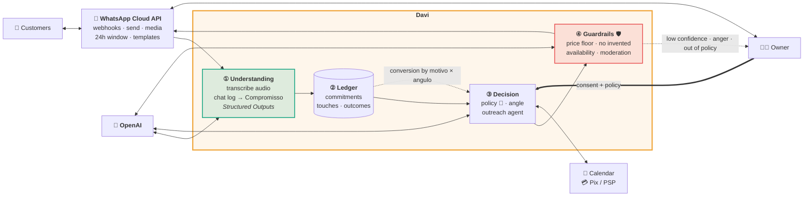

<div align="center">

# Davi

### The intelligence of big companies, for small businesses.

🇬🇧 **English** · [🇧🇷 Português](README.pt-BR.md)

### ▶︎ [Try the live demo](https://hackathon-open-ai.vercel.app)

_Built for the [OpenAI Hackathon · Brasil](https://cerebralvalley.ai/e/openai-hackathon-brasil) — track: **Pequenos Negócios** (Small Businesses)_

</div>

---

A large company runs revenue on qualified people and real structure: trained salespeople
executing a defined commercial process, a CRM that remembers every deal, a score that ranks
all of them, reports that flag the ones going cold. Nothing stalls without someone noticing.

A small business has none of that, for two reasons. Its data lives entirely in WhatsApp —
Brazil's most-used platform — as loose text, audio, and conversation scattered across dozens
of threads, never becoming structure. And there is nobody to work that data: no analyst, no
operations team, nobody whose job is turning that mess into a decision.

So nobody knows which customer paid upfront and vanished halfway through, or which
"let me think about it" never got a follow-up. The money had already been won. It evaporates
without anyone seeing it.

**The thesis: a small business deserves what a big one has. Not a reduced version. The same thing.**

Davi is that. He sits in your WhatsApp, reads every conversation, and understands what each
one actually is: what was promised, for how much, and where it stalled. Then he does the
work. He answers every customer, so nobody is left waiting. He offers what fits what the
person already bought. He goes back after the ones who disappeared. And he recovers the
sales that were already lost. **Every message he sends comes with a reason.**

**How it works:** history goes in, a structured extraction turns each conversation into a
typed commitment, the commitments become a single ledger, and an agent with defined limits
works that ledger.

One demo dataset, a single salon, 33 conversations: **Davi finds R$ 11.482 in stalled
commitments.** The number was always there. What was missing was the intelligence — and
someone to see it.

---

## Why "Davi"

Davi is Brazilian Portuguese for **David**. As in David and Goliath.

Goliath has the stack. David has an inbox. Davi is that entire stack, collapsed into one
contact in the chat list. **Same intelligence, no stack.**

---

## The four acts

The owner never leaves WhatsApp.

```
   1. PAIR              2. READ              3. QUANTIFY           4. WORK
   ─────────            ────────             ──────────            ────────
   Scan a QR      →     "Can I read     →    "I found R$ X   →     Davi works each
   code. Davi           everything            stuck across          thread. Every
   becomes a            that's stuck          N customers."         message carries
   contact.             back there?"                                its reason.
                        ↑ consent gate 1      ↑ consent gate 2
```

1. **Pair** — the owner scans a QR code, exactly like pairing WhatsApp Web. Davi shows up as
   a pinned contact at the top of the chat list. Nothing is installed.
2. **Read** — Davi introduces himself and asks permission before doing anything:
   _"Deixa eu ler tudo que tá parado aí atrás? Não mando nada pra ninguém sem você deixar."_
   ("Let me read everything that's stuck back there? I won't message anyone without your OK.")
3. **Quantify** — Davi sweeps the entire history and comes back with a number:
   **"ACHEI R$ 11.482 parados"** — found, stuck, across 22 customers. Not a report. A number,
   in the chat, in reais.
4. **Work** — the owner authorizes, and Davi starts selling: reactivating abandoned packages,
   closing pending quotes, re-booking no-shows, upselling where it fits. Each closed deal
   pings the owner with the amount.

---

## What makes it different

**🔐 Consent-gated autonomy.** Two explicit gates, both in plain language, both in the chat:
_"Pode ler"_ (you may read) and then _"Pode buscar"_ (you may go get it). Davi never reads
before the first, never sends before the second. Autonomy is granted, not assumed.

**🧠 A reason under every message.** Every message Davi sends renders a gray justification
line beneath it — the `porque` field:

> **Davi →** "Fernanda!! Tem sim, sobraram 4 sessões do seu laser, e elas não vencem 😊 Reservo pra vc essa semana?"
> <sub>_parou na 6ª de 10 · R$ 420 já pagos_ — (stopped at session 6 of 10 · R$ 420 already paid)</sub>

The owner always sees *why* the agent did what it did, at the moment it did it. This is the
audit log, rendered as UI — and it's what makes a small-business owner willing to hand over
their customer relationships.

**📱 It's a contact, not a dashboard.** There is nothing to log into. Davi is a person in the
chat list, and you manage him the way you'd manage an employee — by texting him. _"Pausa a
Bruna."_ _"Não passa de 10% de desconto."_

**🎧 It reads what actually gets sent.** Brazilian WhatsApp is voice notes, no punctuation,
`kkkk`, `vc`, `blz`, and four-month gaps. Davi is built for that inbox, not a clean one.

---

## Architecture at a glance



📐 **Full design, with six diagrams → [`docs/ARCHITECTURE.md`](docs/ARCHITECTURE.md)**
📖 The domain model → [`docs/DOMAIN.md`](docs/DOMAIN.md)
🎬 Demo script → [`docs/DEMO.md`](docs/DEMO.md)
📋 Submission notes → [`docs/SUBMISSION.md`](docs/SUBMISSION.md)

---

## Status

Being precise about this, because it matters.

**What this repository is today: a high-fidelity, interactive prototype of the complete Davi
experience.** It is a pixel-accurate WhatsApp Web client running a real, clickable narrative
end to end — pairing, consent, scan, the money card, autonomous outreach, per-message
rationale, live revenue notifications. You can run it and walk the entire product.

**The agent's reasoning is scripted, not inferred.**

| Layer | Status |
|---|---|
| Product experience (pairing → consent → scan → outreach → reporting) | ✅ Built and interactive |
| Domain model (`Estado`, `Motivo`, `Compromisso`, `Toque`, `angulo`) | ✅ Built — [`src/types.ts`](src/types.ts) |
| Dataset — 33 conversations, 22 commitments, voice notes, 4-month gaps | ✅ Hand-authored |
| WhatsApp Web UI clone (QR pairing, threads, ticks, typing, audio waveforms) | ✅ Built from scratch |
| Conversation understanding (LLM extraction of commitments) | 🔜 Designed, not built — see [ARCHITECTURE](docs/ARCHITECTURE.md) |
| Outreach agent, guardrails, ledger, scheduler | 🔜 Designed, not built |
| WhatsApp Cloud API integration | 🔜 Designed, not built |

---

## Run it

**Live: https://hackathon-open-ai.vercel.app** — nothing to install.

Or locally:

```bash
npm install
npm run dev     # → http://localhost:5173
```

Either way: click or press any key on the QR screen to pair → click **"Pode ler"** in Davi's chat
→ watch the scan → click **"Pode buscar"** → the recovery run takes about 18 seconds.

Notes for presenters:

- `pular()` in [`src/store.ts`](src/store.ts) is an escape hatch that jumps straight to the
  loaded inbox, skipping the pairing animation.
- Time is frozen at `AGORA = 2026-08-19 11:04` so every relative timestamp
  ("ontem", "há 4 meses") renders identically on every run.

```bash
npm run build   # tsc -b && vite build → static dist/
npm run lint    # oxlint
```

---

## Stack

| | |
|---|---|
| **UI** | React 19 · TypeScript 6 · plain CSS (no framework, no UI kit, hand-rolled SVG icons) |
| **State** | Zustand 5 — one store drives the entire demo state machine |
| **Build** | Vite 8 · Oxlint |
| **Runtime deps** | 4 total: `react`, `react-dom`, `zustand`, `qrcode` |
| **Designed for** | OpenAI Responses API (Structured Outputs), OpenAI transcription, WhatsApp Cloud API, Postgres |

~1,550 lines of source. The codebase is written **in Portuguese** — identifiers, types, and
comments (`conversas`, `compromisso`, `travado`, `porque`, `enviar`). That's deliberate: the
domain is Brazilian small-business commerce, and the vocabulary of the code is the vocabulary
of the business it serves. [`docs/DOMAIN.md`](docs/DOMAIN.md) glosses every term in English.

---

<div align="center">
<sub><b>Davi vs. Goliath — same intelligence, no stack.</b></sub>
</div>
