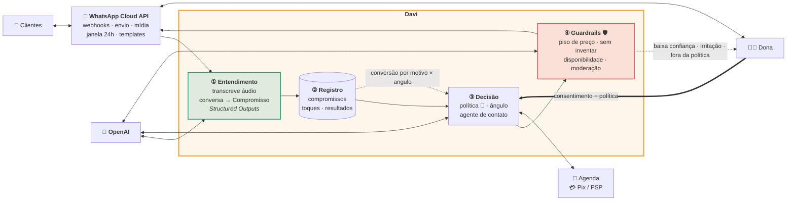

<div align="center">

# Davi

### A inteligência das grandes empresas para os pequenos negócios.

[🇬🇧 English](README.md) · 🇧🇷 **Português**

### ▶︎ [Ver a demo ao vivo](https://hackathon-open-ai.vercel.app)

_Feito para o [OpenAI Hackathon · Brasil](https://cerebralvalley.ai/e/openai-hackathon-brasil) — trilha: **Pequenos Negócios**_

</div>

---

Uma empresa grande opera receita com gente qualificada e estrutura por trás: vendedores
treinados executando um processo comercial definido, um CRM que lembra de cada negócio, uma
pontuação que ordena todos eles, relatórios que apontam os que estão esfriando. Nada para sem
alguém perceber.

O pequeno negócio não tem nada disso, por dois motivos. O dado dele está todo no WhatsApp, a
plataforma mais usada do Brasil, em texto solto, áudio e conversa espalhada por dezenas de
fios, sem nunca virar estrutura. E não existe ninguém para trabalhar esse dado: nenhum
analista, nenhum time de operações, ninguém cuja função seja transformar aquela bagunça em
decisão.

Então ninguém sabe qual cliente pagou adiantado e sumiu no meio do caminho, nem qual "vou
pensar" nunca teve retorno. O dinheiro já tinha sido conquistado. Ele evapora sem ninguém ver.

**A tese: o pequeno negócio merece o que o grande tem. Não uma versão reduzida. A mesma coisa.**

O Davi é isso. Ele fica no seu WhatsApp, lê cada conversa e entende o que cada uma realmente
é: o que foi prometido, por quanto e onde parou. Aí ele faz o trabalho. Responde todo cliente,
para ninguém ficar esperando. Oferece o que combina com o que a pessoa comprou. Volta a
procurar quem sumiu. E recupera as vendas que já estavam perdidas. **Toda mensagem que ele
manda vem com um motivo.**

**Como funciona:** o histórico entra, uma extração estruturada transforma cada conversa em um
compromisso tipado, os compromissos viram um registro único, e um agente com limites definidos
trabalha esse registro.

Uma base de demonstração, um único salão, 33 conversas: **o Davi encontra R$ 11.482 em
compromissos parados.** O número sempre esteve ali. Faltava inteligência e alguém para
enxergar.

---

## Por que "Davi"

Davi, de Davi e Golias.

Golias tem a estrutura. Davi tem uma caixa de entrada. O Davi é essa estrutura inteira,
condensada em um contato na lista de conversas. **A mesma inteligência, sem a estrutura.**

---

## Os quatro atos

O dono nunca sai do WhatsApp.

```
   1. CONECTAR          2. LER               3. QUANTIFICAR        4. TRABALHAR
   ───────────          ──────               ──────────────        ────────────
   Lê um QR code.  →    "Deixa eu ler   →    "Achei R$ X      →    O Davi trabalha
   O Davi vira um       tudo que tá          parados em N          cada conversa.
   contato.             parado aí            clientes."            Toda mensagem
                        atrás?"                                    tem um motivo.
                        ↑ consentimento 1     ↑ consentimento 2
```

1. **Conectar** — o dono lê um QR code, igualzinho a parear o WhatsApp Web. O Davi aparece
   como contato fixado no topo da lista. Nada é instalado.
2. **Ler** — o Davi se apresenta e pede permissão antes de fazer qualquer coisa:
   _"Deixa eu ler tudo que tá parado aí atrás? Não mando nada pra ninguém sem você deixar."_
3. **Quantificar** — o Davi varre todo o histórico e volta com um número:
   **"ACHEI R$ 11.482 parados"** — em 22 clientes. Não é um relatório. É um número, na
   conversa, em reais.
4. **Trabalhar** — o dono autoriza e o Davi começa a vender: reativa pacotes abandonados,
   fecha orçamentos pendentes, remarca quem sumiu, oferece combo onde faz sentido. Cada venda
   fechada chega como notificação, com o valor.

---

## O que torna isso diferente

**🔐 Autonomia com consentimento.** Dois portões explícitos, em português claro, dentro da
conversa: _"Pode ler"_ e depois _"Pode buscar"_. O Davi não lê antes do primeiro e não manda
nada antes do segundo. Autonomia é concedida, nunca presumida.

**🧠 Um motivo embaixo de cada mensagem.** Toda mensagem que o Davi manda tem uma linha cinza
de justificativa embaixo — o campo `porque`:

> **Davi →** "Fernanda!! Tem sim, sobraram 4 sessões do seu laser, e elas não vencem 😊 Reservo pra vc essa semana?"
> <sub>_parou na 6ª de 10 · R$ 420 já pagos_</sub>

O dono sempre vê *por que* o agente fez o que fez, no momento em que fez. Isso é o log de
auditoria, renderizado como interface — e é o que faz um dono de pequeno negócio topar
entregar o relacionamento com os clientes dele.

**📱 É um contato, não um dashboard.** Não tem nada para logar. O Davi é uma pessoa na lista
de conversas, e você gerencia ele como gerenciaria um funcionário — mandando mensagem.
_"Pausa a Bruna."_ _"Não passa de 10% de desconto."_

**🎧 Ele lê o que de fato é enviado.** WhatsApp brasileiro é áudio, sem pontuação, `kkkk`,
`vc`, `blz`, e buraco de quatro meses. O Davi foi feito para essa caixa de entrada, não para
uma limpinha.

---

## Arquitetura em um olhar



📐 **Projeto completo, com seis diagramas → [`docs/ARQUITETURA.md`](docs/ARQUITETURA.md)**
📖 O modelo de domínio → [`docs/DOMINIO.md`](docs/DOMINIO.md)
🎬 Roteiro da demo → [`docs/DEMO.pt-BR.md`](docs/DEMO.pt-BR.md)
📋 Notas de submissão → [`docs/SUBMISSAO.md`](docs/SUBMISSAO.md)

---

## Status

Sendo preciso sobre isso, porque importa.

**O que este repositório é hoje: um protótipo interativo de alta fidelidade da experiência
completa do Davi.** É um cliente WhatsApp Web pixel a pixel rodando uma narrativa real e
clicável de ponta a ponta — pareamento, consentimento, varredura, o card do dinheiro, contato
autônomo, justificativa por mensagem, notificações de venda ao vivo. Dá para rodar e percorrer
o produto inteiro.

**O raciocínio do agente é roteirizado, não inferido.**

| Camada | Status |
|---|---|
| Experiência do produto (parear → consentir → varrer → contatar → reportar) | ✅ Construída e interativa |
| Modelo de domínio (`Estado`, `Motivo`, `Compromisso`, `Toque`, `angulo`) | ✅ Construído — [`src/types.ts`](src/types.ts) |
| Base de dados — 33 conversas, 22 compromissos, áudios, buracos de 4 meses | ✅ Escrita à mão |
| Clone da interface do WhatsApp Web (QR, conversas, ticks, digitando, ondas de áudio) | ✅ Construído do zero |
| Entendimento de conversa (extração de compromissos por LLM) | 🔜 Projetado, não construído — ver [ARQUITETURA](docs/ARQUITETURA.md) |
| Agente de contato, guardrails, registro, agendador | 🔜 Projetado, não construído |
| Integração com WhatsApp Cloud API | 🔜 Projetado, não construído |

---

## Como rodar

**Ao vivo: https://hackathon-open-ai.vercel.app** — sem instalar nada.

Ou localmente:

```bash
npm install
npm run dev     # → http://localhost:5173
```

De qualquer forma: clique ou aperte qualquer tecla na tela do QR para parear → clique em **"Pode ler"** na
conversa do Davi → assista à varredura → clique em **"Pode buscar"** → a execução leva cerca de
18 segundos.

Notas para quem for apresentar:

- `pular()` em [`src/store.ts`](src/store.ts) é uma saída de emergência que pula direto para a
  caixa de entrada carregada, sem a animação de pareamento.
- O tempo está congelado em `AGORA = 2026-08-19 11:04`, então todo horário relativo
  ("ontem", "há 4 meses") renderiza igual em toda execução.

```bash
npm run build   # tsc -b && vite build → dist/ estático
npm run lint    # oxlint
```

---

## Stack

| | |
|---|---|
| **Interface** | React 19 · TypeScript 6 · CSS puro (sem framework, sem UI kit, ícones SVG à mão) |
| **Estado** | Zustand 5 — uma store move toda a máquina de estados da demo |
| **Build** | Vite 8 · Oxlint |
| **Dependências de runtime** | 4 no total: `react`, `react-dom`, `zustand`, `qrcode` |
| **Projetado para** | OpenAI Responses API (Structured Outputs), transcrição OpenAI, WhatsApp Cloud API, Postgres |

~1.550 linhas de código. A base é escrita **em português** — identificadores, tipos e
comentários (`conversas`, `compromisso`, `travado`, `porque`, `enviar`). É deliberado: o
domínio é o comércio de pequeno negócio brasileiro, e o vocabulário do código é o vocabulário
do negócio que ele serve.

---

<div align="center">
<sub><b>Davi contra Golias — a mesma inteligência, sem a estrutura.</b></sub>
</div>
