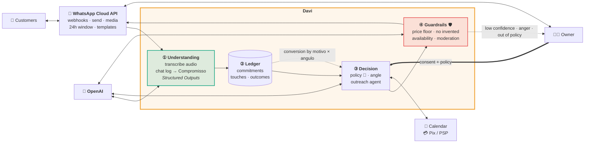
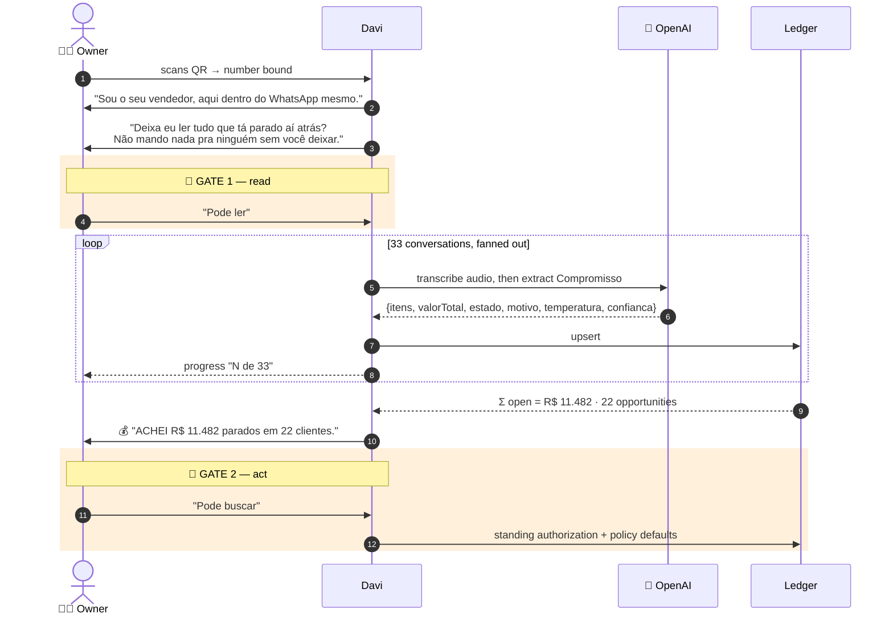
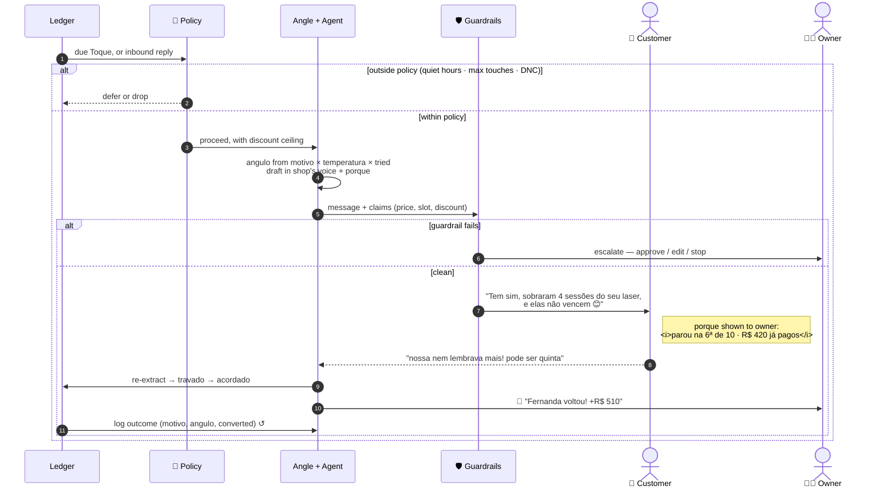

# Davi — Architecture

🇬🇧 **English** · [🇧🇷 Português](ARQUITETURA.md)

> This describes the system Davi is **designed** to be. The repo today is a high-fidelity
> prototype of the experience, with the agent's reasoning scripted rather than inferred. See
> [Status](../README.md#status), and [Prototype → Target](#prototype--target) below for the
> behavior-by-behavior mapping.

---

## The idea

A WhatsApp inbox is an unstructured, un-queryable record of every deal a small business has
almost closed. Davi turns it into a typed pipeline.

An extraction pass reads each conversation and emits a **commitment** — what was promised, for
how much, what state it's in, *why* it stalled, how warm it still is, and how confident the
model is. Those land in a ledger. A policy-bounded agent then works the ledger back into
revenue: picking an angle appropriate to why the deal stalled, drafting in the shop's own
voice, checking itself against hard guardrails, sending, and recording the outcome so the next
decision is better. The owner sits above all of it as a control plane, inside WhatsApp.

The hard part isn't sending messages. It's **being trusted to send them** — which is why
consent gates, per-message rationale, and guardrails are architectural components here, not
features bolted on later.

---

## 1 · Architecture

### ① Understanding

The core. Voice notes are transcribed first — Brazilian WhatsApp runs on audio, and the demo
dataset alone has five notes of 36–52s each carrying real deal information. Then each
conversation goes to the **Responses API with Structured Outputs** and comes back as a
`Compromisso` conforming to [`src/types.ts`](../src/types.ts): items, total value, `estado`,
`motivo`, `temperatura`, `confianca`.

This is the transformation the product is built on. Everything downstream is ordinary software
once this works. It runs across the full backlog on pairing — the value is in the *backlog*; a
bot that only handles new messages solves the easy half.

### ② Ledger

Postgres. Conversations, commitments, touches, outcomes, consent state. A CRM the owner never
had to fill in — derived from what they were already doing — and the memory that keeps
follow-ups coherent across weeks.

### ③ Decision

Three things in order:

- **Policy & consent** 🔐 — autonomy level, discount ceiling, quiet hours, max touches per
  contact, do-not-contact. Enforced server-side. Consent has to be a *component*, not a prompt
  instruction: a model can be talked out of a prompt, but not past a check it never sees.
- **Angle selection** — picks the `angulo` (`lembrete_simples`, `retomada_pacote`,
  `facilita_pagamento`, `desconto`, `escassez`, `prova_social`) from `motivo` × `temperatura` ×
  what's already been tried. The reason a deal stalled determines what unsticks it: someone
  waiting on a spouse doesn't need a discount; someone who prepaid and drifted just needs to
  know the sessions don't expire.
- **Outreach agent** — drafts few-shot on the owner's *own* past messages, so the voice is the
  shop's. Emits a structured `porque` rationale with every message. Tools: `get_availability`,
  `hold_slot`, `create_pix_charge`, `apply_discount`, `escalate_to_owner`, `log_outcome`.

### ④ Guardrails

Hard checks before send: price floor, no invented availability or inventory, moderation,
escalate on anger/ambiguity/low `confianca`. The failure mode that kills this product isn't a
bad message — it's one promising a price or a slot that doesn't exist. So availability is
read-through and fails closed, and discount ceilings are enforced outside the model.

### Model routing

| Job | Model | Why |
|---|---|---|
| Voice note → text | `gpt-4o-transcribe` | Batch, offline, once per audio |
| Conversation → `Compromisso` | Reasoning model + Structured Outputs | Hardest step; everything downstream inherits its errors, so it's the wrong place to economize |
| Draft the message | Fast chat model, voice few-shot | Latency matters — the customer is typing |
| Judge the draft | Small model + deterministic rules | Runs in a **separate context**; a critic that never saw the drafting prompt can't be talked into its mistake |
| Owner's NL commands | Small model + Structured Outputs | _"não passa de 10%"_ → `discountCeiling: 0.10` |

---

## 2 · Cold start

The first ninety seconds, where the product either earns trust or doesn't.

The design point: **Davi asks for money-finding permission before money-making permission**,
and the number arrives *between* the two gates. The owner authorizes autonomy while looking at
a concrete figure, not a promise.

---

## 3 · The recovery loop

Every path either sends within policy, defers, or **hands control back to the human**. There is
no branch where the agent proceeds on its own judgment past a failed check.

---

## 4 · Commitment lifecycle

The `Estado` machine, already encoded in [`src/types.ts`](../src/types.ts). This is what
extraction classifies into, and what Davi moves rightward.

```mermaid
stateDiagram-v2
    direction LR

    [*] --> novo: customer first messages
    novo --> orcado: price quoted
    orcado --> acordado: customer agrees
    acordado --> recuperado: paid / attended ✅

    novo --> travado: never answered
    orcado --> travado: no reply
    acordado --> travado: never sent the Pix

    travado --> acordado: Davi unsticks it 💚
    travado --> perdido: exhausted / declined ❌
    travado --> pausado: owner intervenes ⏸️
    pausado --> travado: resumed

    recuperado --> [*]
    perdido --> [*]

    note right of travado
        <b>travado = "stuck".</b> This is where
        the money is. Every stuck commitment
        carries a Motivo explaining why:

        preco — price objection
        terceiro — needs to ask a spouse
        sumico_pos_acordo — ghosted after agreeing
        sem_grana — no money right now
        pacote_parado — prepaid package abandoned
        outro — other

        The Motivo picks the Angulo.
    end note
```

Demo dataset: **12 `travado`**, 5 `orcado`, 4 `acordado` — stall reasons splitting
`pacote_parado` 4, `sumico_pos_acordo` 4, `preco` 3, `terceiro` 2, `sem_grana` 2. Different
reasons, different plays. A single "follow up politely" bot leaves most of that on the table.

---

## Cross-cutting

**Privacy.** Davi reads a small business's entire customer history — the most sensitive data it
has. Extraction stores the *structured result*, not raw transcripts, beyond a retention window.
The consent gate is recorded with a timestamp. The owner can revoke and purge from the chat.
Per-tenant row-level isolation in the ledger.

**Reversibility.** Every autonomous action is logged with its `porque`. The owner can pause any
contact, any angle, or Davi entirely, by texting him. Draft-only mode exists as a first-week
setting, so autonomy is earned rather than granted on day one.

**Failure modes designed against.** Messaging someone who already bought elsewhere (re-extract
before every send). Repeating a failed angle (touch history). Promising a slot that's gone
(`get_availability` never cached optimistically). Discount spirals (hard ceiling outside the
model). Sounding like a bot to a customer who knows the owner personally (voice few-shot + the
escalate path).

**Scale.** The backlog sweep is embarrassingly parallel — one extraction per conversation, no
cross-conversation dependency. Steady state is a low-rate durable queue. Neither is the hard
part; trust is.

---

## Prototype → Target

| In the demo today | Produced by | In the target system |
|---|---|---|
| QR pairing ([`src/ui/QR.tsx`](../src/ui/QR.tsx)) | Real QR of a fictional `davi.app/pair/…` URL | WhatsApp Cloud API number binding |
| Davi's intro + consent asks | Hardcoded strings in `conectar()` | Same copy, real gates |
| Scan progress "N de 33" | Timer incrementing a float | Real fan-out of extraction jobs |
| **"ACHEI R$ 11.482 parados"** | ✅ **Genuinely computed** — `TOTAL_PARADO` sums the dataset in [`src/store.ts`](../src/store.ts) | Same sum, over extracted commitments |
| Each conversation's `estado` / `motivo` / `temperatura` / `confianca` | Hand-authored in [`src/data/conversas.ts`](../src/data/conversas.ts) | ① Understanding — same schema |
| Davi's outreach messages + `porque` | Authored constants in `ROTEIRO` ([`src/data/davi.ts`](../src/data/davi.ts)) | ③ Outreach agent, voice few-shot |
| Customer replies & typing | Scripted `setTimeout` events | Real inbound webhooks |
| Sale toasts, R$ 510 / R$ 280 / R$ 70 | Authored constants | Ledger → `recuperado`, confirmed by PSP webhook |
| Follow-up `angulo` per contact | Hand-authored `toques[]` | ③ Angle selection + outcome loop |
| "Sem resposta" inbox filter | Real — last author is the customer | Unchanged; already the right query |

The prototype is a specification with a UI. `src/types.ts` is the schema, `ROTEIRO` is the
expected output, and the demo is the acceptance test: **when the real pipeline reproduces this
run from raw chat logs, it's done.**
