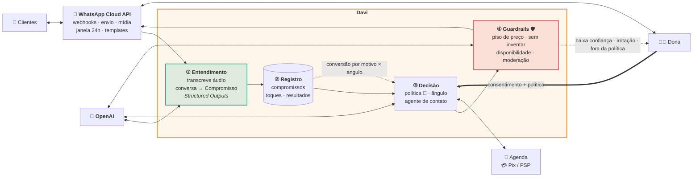
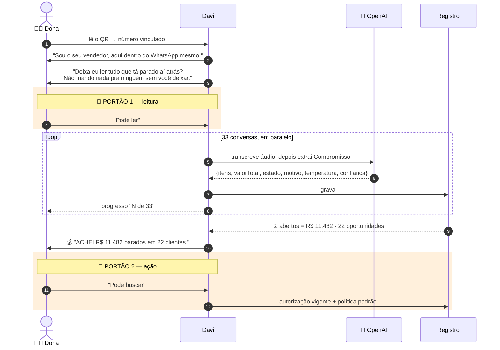
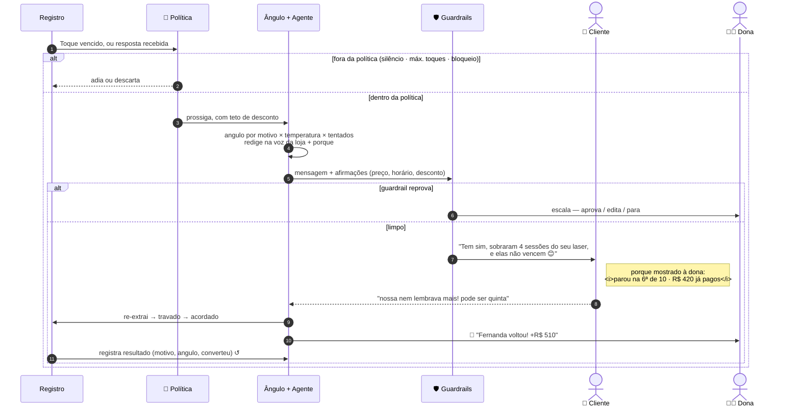

# Davi — Arquitetura

[🇬🇧 English](ARCHITECTURE.md) · 🇧🇷 **Português**

> Isto descreve o sistema que o Davi foi **projetado** para ser. O repositório hoje é um
> protótipo de alta fidelidade da experiência, com o raciocínio do agente roteirizado em vez de
> inferido. Veja [Status](../README.pt-BR.md#status), e [Protótipo → Alvo](#protótipo--alvo)
> abaixo para o mapeamento comportamento a comportamento.

---

## A ideia

Uma caixa de entrada do WhatsApp é um registro não estruturado e não consultável de todo
negócio que um pequeno negócio quase fechou. O Davi transforma isso em um funil tipado.

Uma etapa de extração lê cada conversa e emite um **compromisso** — o que foi prometido, por
quanto, em que estado está, *por que* travou, quão quente ainda está e quão confiante o modelo
está. Isso vai para um registro. Um agente com limites definidos então trabalha esse registro
de volta em receita: escolhe um ângulo apropriado ao motivo do travamento, redige na voz da
própria loja, se confere contra guardrails rígidos, envia, e registra o resultado para que a
próxima decisão seja melhor. A dona fica acima de tudo como plano de controle, dentro do
WhatsApp.

A parte difícil não é mandar mensagem. É **ter permissão para mandar** — e por isso portões de
consentimento, justificativa por mensagem e guardrails são componentes arquiteturais aqui, não
funcionalidades parafusadas depois.

---

## 1 · Arquitetura

### ① Entendimento

O núcleo. Áudios são transcritos primeiro — WhatsApp brasileiro roda em áudio, e só a base de
demonstração tem cinco notas de 36 a 52 segundos carregando informação real de negócio. Depois
cada conversa vai para a **Responses API com Structured Outputs** e volta como um `Compromisso`
conforme [`src/types.ts`](../src/types.ts): itens, valor total, `estado`, `motivo`,
`temperatura`, `confianca`.

É a transformação sobre a qual o produto é construído. Tudo depois disso é software comum, uma
vez que isso funcione. Roda sobre todo o histórico no pareamento — o valor está no *histórico*;
um bot que só cuida de mensagem nova resolve a metade fácil.

### ② Registro

Postgres. Conversas, compromissos, toques, resultados, estado de consentimento. Um CRM que a
dona nunca precisou preencher — derivado do que ela já fazia — e a memória que mantém o
follow-up coerente ao longo de semanas.

### ③ Decisão

Três coisas, nesta ordem:

- **Política e consentimento** 🔐 — nível de autonomia, teto de desconto, horário de silêncio,
  máximo de toques por contato, lista de bloqueio. Aplicado no servidor. Consentimento tem que
  ser um *componente*, não uma instrução de prompt: um modelo pode ser convencido a sair de um
  prompt, mas não passa por uma checagem que nunca vê.
- **Seleção de ângulo** — escolhe o `angulo` (`lembrete_simples`, `retomada_pacote`,
  `facilita_pagamento`, `desconto`, `escassez`, `prova_social`) a partir de `motivo` ×
  `temperatura` × o que já foi tentado. O motivo do travamento determina o que destrava: quem
  está esperando o marido não precisa de desconto; quem pagou pacote e sumiu só precisa saber
  que as sessões não vencem.
- **Agente de contato** — redige com few-shot nas mensagens **da própria dona**, para que a voz
  seja a da loja. Emite uma justificativa estruturada (`porque`) com cada mensagem.
  Ferramentas: `get_availability`, `hold_slot`, `create_pix_charge`, `apply_discount`,
  `escalate_to_owner`, `log_outcome`.

### ④ Guardrails

Checagens rígidas antes do envio: piso de preço, sem inventar disponibilidade ou estoque,
moderação, escalar em irritação/ambiguidade/`confianca` baixa. O modo de falha que mata este
produto não é uma mensagem ruim — é uma que promete um preço ou um horário que não existe.
Então disponibilidade é lida direto e falha fechando, e o teto de desconto é aplicado fora do
modelo.

### Roteamento de modelos

| Trabalho | Modelo | Por quê |
|---|---|---|
| Áudio → texto | `gpt-4o-transcribe` | Em lote, offline, uma vez por áudio |
| Conversa → `Compromisso` | Modelo de raciocínio + Structured Outputs | Etapa mais difícil; tudo depois herda seus erros, então é o lugar errado para economizar |
| Redigir a mensagem | Modelo de chat rápido, few-shot de voz | Latência importa — o cliente está digitando |
| Julgar o rascunho | Modelo pequeno + regras determinísticas | Roda em **contexto separado**; um crítico que nunca viu o prompt de redação não pode ser convencido pelo erro dele |
| Comandos da dona | Modelo pequeno + Structured Outputs | _"não passa de 10%"_ → `discountCeiling: 0.10` |

---

## 2 · Partida a frio

Os primeiros noventa segundos, onde o produto ganha ou não ganha confiança.

O ponto de design: **o Davi pede permissão para achar dinheiro antes de pedir permissão para
fazer dinheiro**, e o número chega *entre* os dois portões. A dona autoriza a autonomia olhando
para uma cifra concreta, não para uma promessa.

---

## 3 · O loop de recuperação

Todo caminho ou envia dentro da política, ou adia, ou **devolve o controle para o humano**. Não
existe ramo em que o agente siga pelo próprio julgamento após uma checagem reprovada.

---

## 4 · Ciclo de vida do compromisso

A máquina de `Estado`, já codificada em [`src/types.ts`](../src/types.ts). É nisso que a
extração classifica, e é o que o Davi move para a direita.

```mermaid
stateDiagram-v2
    direction LR

    [*] --> novo: cliente manda a primeira mensagem
    novo --> orcado: preço informado
    orcado --> acordado: cliente concorda
    acordado --> recuperado: pago / atendido ✅

    novo --> travado: nunca foi respondido
    orcado --> travado: sem resposta
    acordado --> travado: nunca mandou o Pix

    travado --> acordado: o Davi destrava 💚
    travado --> perdido: esgotado / recusado ❌
    travado --> pausado: a dona intervém ⏸️
    pausado --> travado: retomado

    recuperado --> [*]
    perdido --> [*]

    note right of travado
        <b>travado.</b> É aqui que está o dinheiro.
        Todo compromisso travado carrega
        um Motivo explicando por quê:

        preco — objeção de preço
        terceiro — precisa falar com o marido
        sumico_pos_acordo — sumiu depois de fechar
        sem_grana — sem dinheiro agora
        pacote_parado — pacote pago abandonado
        outro — outro

        O Motivo escolhe o Angulo.
    end note
```

Base de demonstração: **12 `travado`**, 5 `orcado`, 4 `acordado` — motivos divididos em
`pacote_parado` 4, `sumico_pos_acordo` 4, `preco` 3, `terceiro` 2, `sem_grana` 2. Motivos
diferentes, jogadas diferentes. Um único bot de "faz um follow-up educado" deixa a maior parte
disso na mesa.

---

## Transversais

**Privacidade.** O Davi lê o histórico inteiro de clientes de um pequeno negócio — o dado mais
sensível que ele tem. A extração guarda o *resultado estruturado*, não a transcrição bruta,
além de uma janela de retenção. O portão de consentimento é registrado com carimbo de tempo. A
dona pode revogar e apagar pela própria conversa. Isolamento por tenant no registro.

**Reversibilidade.** Toda ação autônoma é registrada com seu `porque`. A dona pode pausar
qualquer contato, qualquer ângulo, ou o Davi inteiro, por mensagem. Existe um modo "só
rascunho" como configuração de primeira semana, para que a autonomia seja conquistada em vez de
concedida no primeiro dia.

**Modos de falha contra os quais projetamos.** Falar com quem já comprou em outro lugar
(re-extrair antes de todo envio). Repetir um ângulo que falhou (histórico de toques). Prometer
um horário que já foi (`get_availability` nunca cacheado com otimismo). Espiral de desconto
(teto rígido fora do modelo). Soar como robô para um cliente que conhece a dona pessoalmente
(few-shot de voz + caminho de escalada).

**Escala.** A varredura do histórico é constrangedoramente paralela — uma extração por conversa,
sem dependência entre conversas. O regime permanente é uma fila durável de baixa taxa. Nenhum
dos dois é a parte difícil; confiança é.

---

## Protótipo → Alvo

| Na demo hoje | Produzido por | No sistema alvo |
|---|---|---|
| Pareamento por QR ([`src/ui/QR.tsx`](../src/ui/QR.tsx)) | QR real de uma URL fictícia `davi.app/pair/…` | Vínculo de número via WhatsApp Cloud API |
| Apresentação + pedidos de consentimento | Strings fixas em `conectar()` | Mesmo texto, portões reais |
| Progresso "N de 33" | Timer incrementando um float | Paralelização real dos jobs de extração |
| **"ACHEI R$ 11.482 parados"** | ✅ **Calculado de verdade** — `TOTAL_PARADO` soma a base em [`src/store.ts`](../src/store.ts) | Mesma soma, sobre compromissos extraídos |
| `estado` / `motivo` / `temperatura` / `confianca` de cada conversa | Escritos à mão em [`src/data/conversas.ts`](../src/data/conversas.ts) | ① Entendimento — mesmo schema |
| Mensagens do Davi + `porque` | Constantes em `ROTEIRO` ([`src/data/davi.ts`](../src/data/davi.ts)) | ③ Agente de contato, few-shot de voz |
| Respostas dos clientes e "digitando…" | Eventos `setTimeout` roteirizados | Webhooks reais de entrada |
| Toasts de venda, R$ 510 / R$ 280 / R$ 70 | Constantes escritas à mão | Registro → `recuperado`, confirmado por webhook do PSP |
| `angulo` por contato | `toques[]` escritos à mão | ③ Seleção de ângulo + loop de resultado |
| Filtro "Sem resposta" | Real — último autor é o cliente | Inalterado; já é a consulta certa |

O protótipo é uma especificação com interface. `src/types.ts` é o schema, `ROTEIRO` é a saída
esperada, e a demo é o teste de aceitação: **quando o pipeline real reproduzir essa execução a
partir de conversas cruas, está pronto.**
